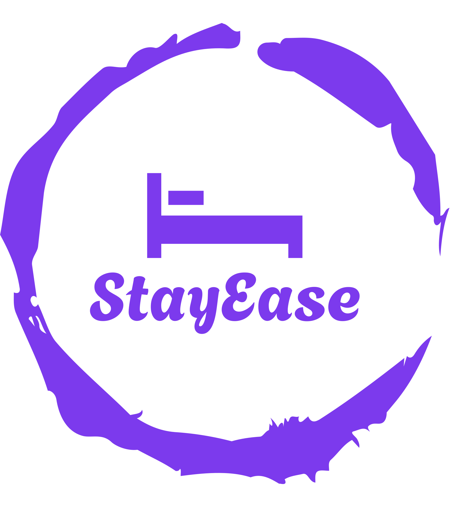
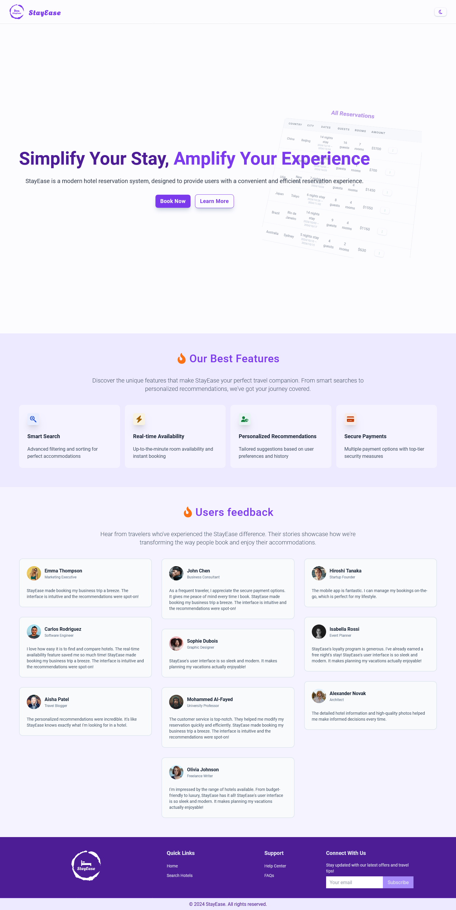
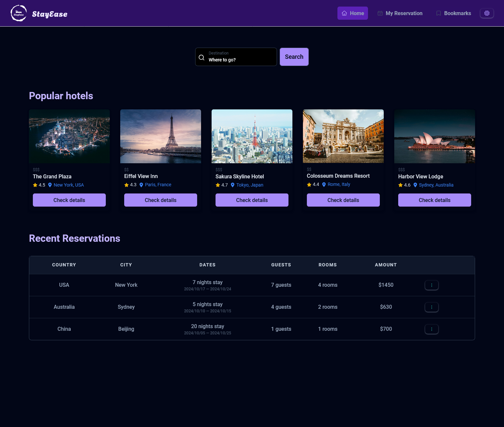
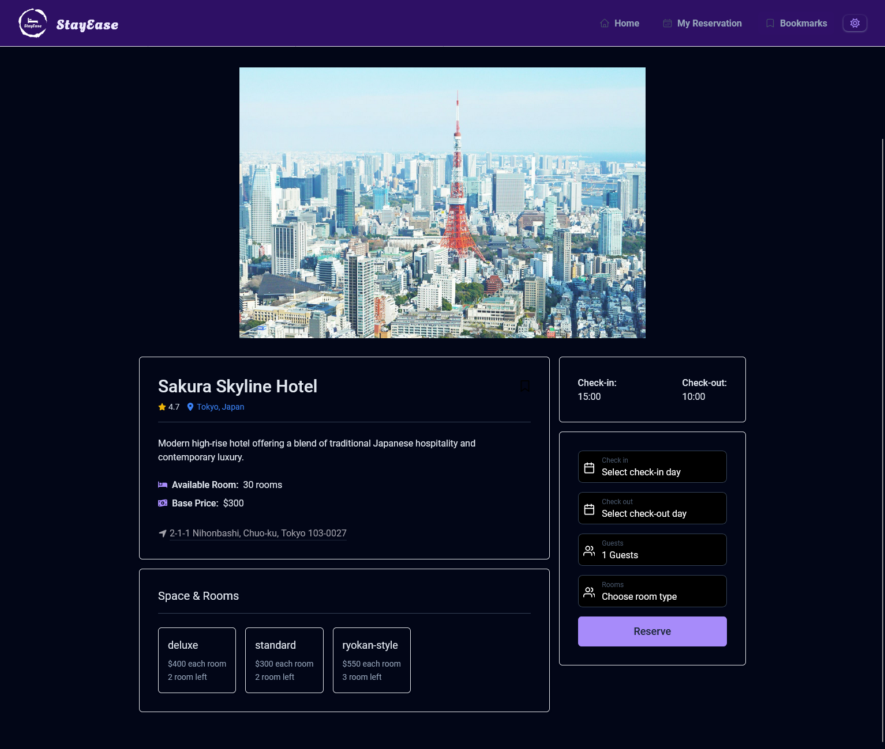
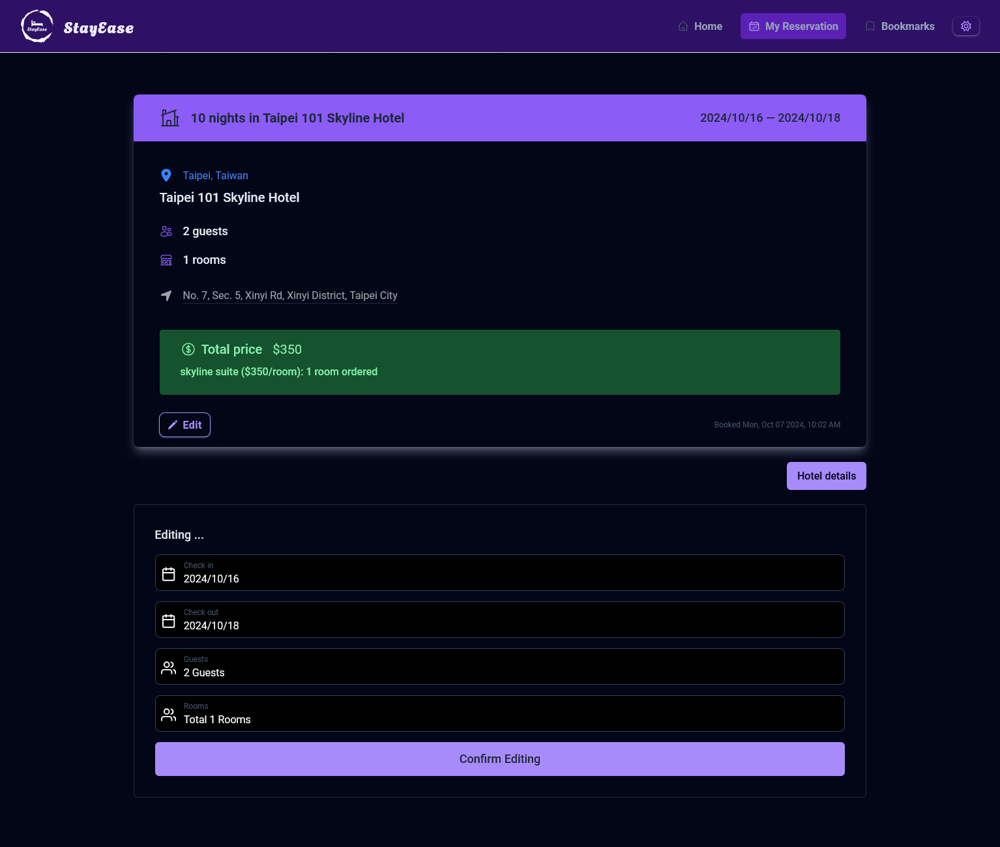

<p align='center'>
  <a href='https://stayease-stevenhuang0604.vercel.app/' target='_blank'>
    
  </a>
</p>

# STAYEASE

StayEase is a modern, user-friendly hotel booking platform designed to simplify the process of finding and reserving accommodations. With an intuitive interface and powerful features, StayEase offers a seamless experience for travelers looking for their perfect stay.

## Screenshots







## Features

- **Engaging Homepage**: A welcoming landing page featuring:

  - Hero section showcasing the platform's main benefits
  - Feature section highlighting key functionalities
  - Testimonial section with user reviews
  - Comprehensive footer with essential links and information

- **Dynamic Main App Page**:

  - Intuitive search bar for city-based hotel searches
  - Display of popular hotels and recent bookings
  - Dark mode toggle for comfortable viewing in any lighting condition

- **Comprehensive Hotel Listings**:

  - Detailed hotel cards displaying price range, name, rating, city, available rooms, base price, and address
  - "Check Detail" button for in-depth hotel information

- **Detailed Hotel Information**:

  - Comprehensive overview of room types and their respective prices
  - Clear display of check-in and check-out times
  - Interactive booking form allowing selection of dates, guest numbers, and room quantities
  - Seamless transition to reservation overview upon form submission

- **User-friendly Reservations Management**:

  - Overview of all bookings including city, country, dates, guest numbers, room quantities, and total amount
  - Option to view detailed reservation information or cancel bookings

- **Flexible Reservation Editing**:

  - Detailed view of reservation information
  - Ability to modify booking details such as dates, guest numbers, and room selections

- **Bookmark Functionality**:

  - Option to bookmark favorite hotels from listings or detail pages
  - Dedicated bookmarks page for easy access to saved hotels

- **Dark Mode Support**:
  - Toggle between light and dark modes for comfortable viewing across the entire application

## Tech Stack

This project leverages a modern and efficient tech stack:

### Frontend

- **Library**: React
- **Routing**: React Router
- **State Management & Data Fetching**: React Query

### Styling

- **CSS Framework**: TailwindCSS

### Backend & Database

- **Backend as a Service**: Supabase

### Build & Development

- **Build Tool**: Vite

### Deployment

- **Hosting Platform**: Vercel

## Getting Started

To run this project locally:

1. Clone this repository:

   ```
   git clone https://github.com/stevenHuang0604/stayease.git
   ```

2. Navigate to the project directory:

   ```
   cd stayease
   ```

3. Install dependencies:

   ```
   npm install
   ```

4. Create a `.env` file in the root directory and add your Supabase credentials:

   ```
   VITE_SUPABASE_URL=your_supabase_url
   VITE_SUPABASE_KEY=your_supabase_key
   ```

5. Set up your Supabase database with the necessary tables and data. (Detailed instructions for database setup can be added here)

6. Start the development server:

   ```
   npm run dev
   ```

7. Open your browser and navigate to `http://localhost:5173` (or the port specified by Vite) to view the app.
